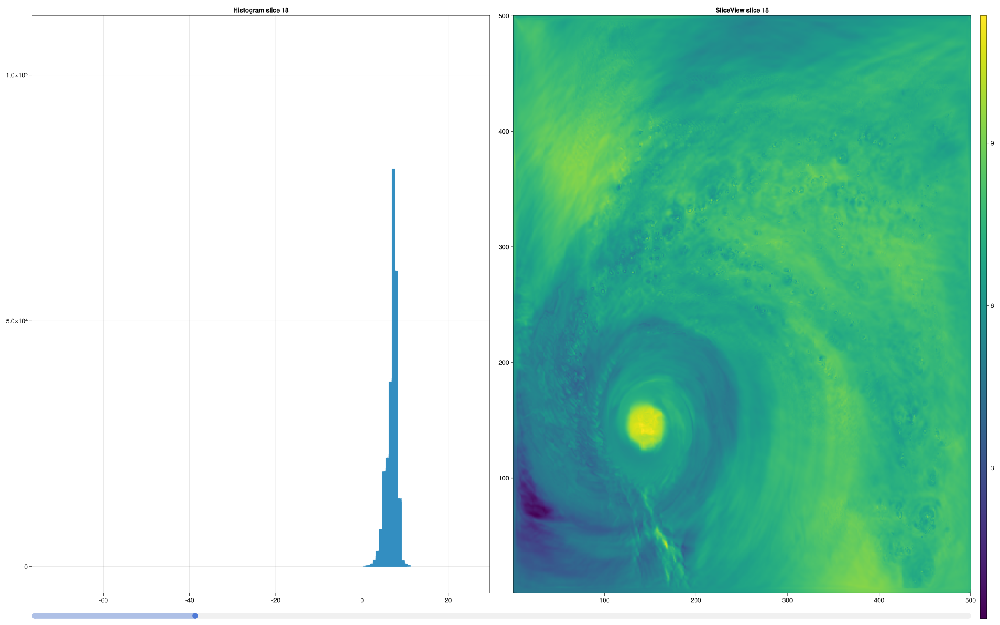

# SliceExplore

A simple slice viewer written in Julia to learn Makie

```bash
#uses the TCf48 files from Hurricane from SDRBench
julia --project ./scripts/slice_explorer.jl -i ~/git/datasets/hurricane/100x500x500/TCf48.bin.f32 -d 500 -d 500 -d 100 -t float
```


